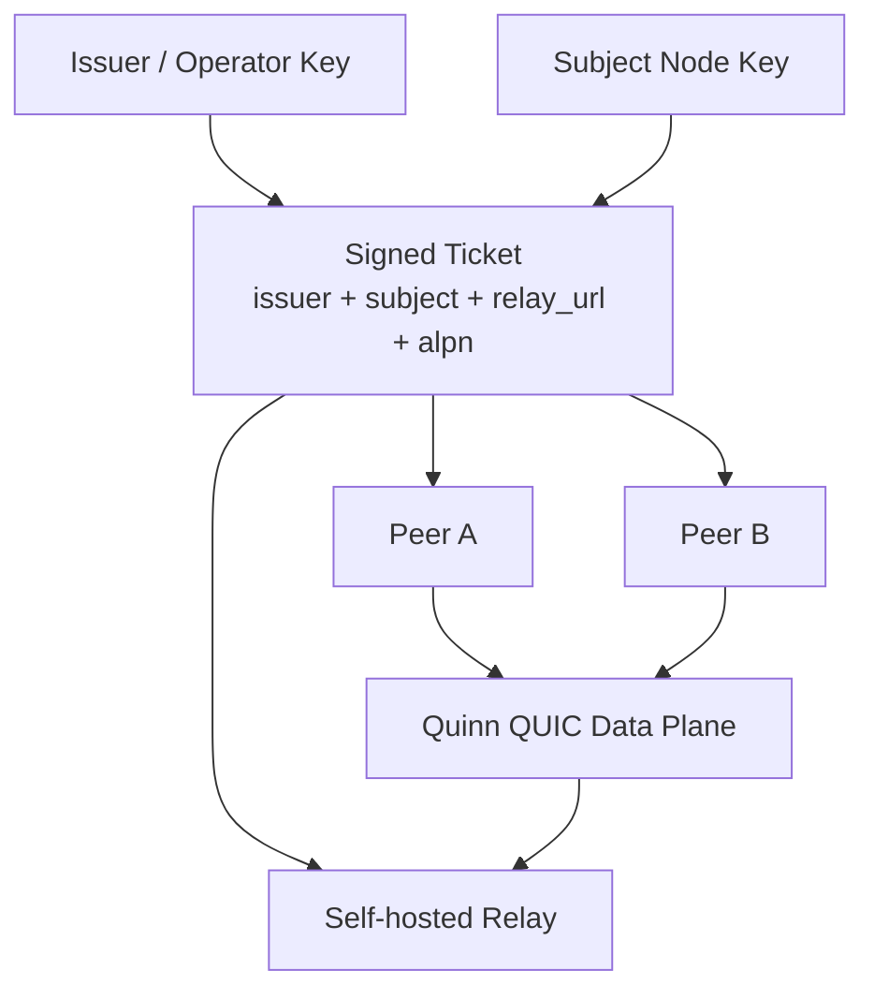
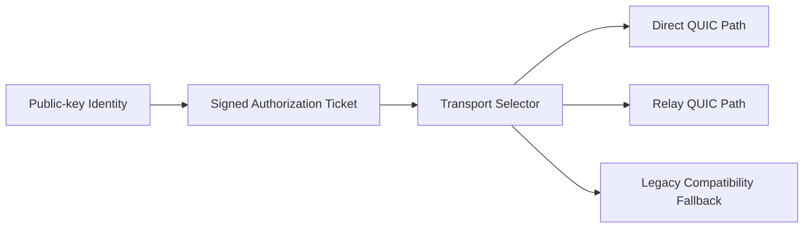

# SnapPipe Architecture

## Purpose

SnapPipe is an identity-first transport/control-plane project for environments where plain location-based addressing is not enough.

Its job is not to replace every existing fallback path overnight. Its job is to make a better path available:

- identity-bound instead of IP-bound
- QUIC-capable instead of TCP-only
- self-hosted relay friendly instead of managed-service dependent
- explicit authorization via signed tickets instead of implicit trust in path reachability

## Control plane vs data plane

The project is intentionally split into two concerns.

1. Control plane
   - node identities
   - signed tickets
   - relay/operator policy
   - ALPN/profile selection

2. Data plane
   - QUIC endpoints
   - streams and datagrams
   - MTU discovery
   - keepalive / idle timeout / flow control tuning

The current repository already has the control-plane foundation and now also carries a compiled Quinn-based QUIC transport profile layer for the next step.

## High-level flow

## Transport strategy

SnapPipe is meant to provide multiple transport personalities without changing the identity model.

The selector idea matters because real deployments are messy. Some paths will allow direct UDP, some will need a relay, and some environments may still need an older compatibility path. The identity and ticket format should survive all three.

## Quinn role in the stack

Quinn is now the chosen QUIC foundation for the Rust data plane because it provides:

- `Endpoint` / `Connection` split suitable for peer and relay roles
- reliable streams and unreliable datagrams under one connection
- tunable `TransportConfig`
- MTU discovery and datagram buffering knobs needed for latency-sensitive workloads

The current implementation stops short of claiming a full session runtime. What it adds now is:

- named QUIC transport profiles
- explicit datagram/window/idle-timeout tuning
- MTU discovery configuration
- a compiled foundation that future client/relay bootstraps can consume

## Profiles

Two profiles are modeled today:

1. `low-latency-interactive`
   - intended for fast client-to-client or client-to-edge sessions
   - smaller stream counts
   - aggressive keepalive
   - datagrams enabled

2. `relay-backhaul`
   - intended for relay-facing sessions
   - larger windows and stream counts
   - more breathing room for multiplexed traffic

## Integration principle

Anything consuming SnapPipe should integrate at the transport seam, not by leaking transport details into UI/application logic.

That means downstream clients can either:

- use SnapPipe directly, or
- re-implement the same architectural ideas natively

without rewriting the identity/ticket/transport boundaries from scratch each time.