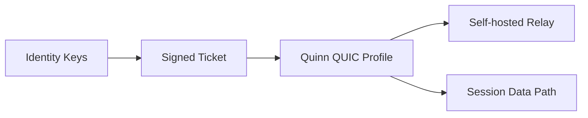

# SnapPipe

Identity-based transport toolkit for self-hosted, low-latency peer connectivity.

SnapPipe is meant to move the fallback story away from location-based addressing (`ip:port`) and toward **identity-based networking**:

- a node is identified by its **public key**, not by a volatile address
- sessions are gated by **signed tickets** before any peer attempts a handshake
- relay infrastructure is designed to be **self-hosted** instead of tied to a paid managed relay tier

## Why this exists

When strict NATs, firewalls, captive campus networks, or carrier-grade mobile networks force transport to degrade toward TCP-ish behavior, rollback-sensitive real-time sessions become fragile because of head-of-line blocking.

SnapPipe aims to provide a cleaner fallback layer:

- keep the connection anchored to an identity
- keep rebind/reconnect cheap when the network path changes
- keep the operator in control of relay infrastructure
- keep the software stack open and inspectable

## Current scope (v0.1.0)

This repository already implements the **security/control-plane foundation**:

- Ed25519 identity generation
- stable node IDs derived from public keys
- signed session tickets with explicit issuer and subject identities
- offline ticket verification
- Quinn-based QUIC transport profiles for low-latency and relay-oriented tuning
- sample relay configuration scaffold
- CLI for issuing / inspecting / verifying tickets

This is intentionally the **first serious layer**, not a fake “we solved everything” release.

## Architecture

Detailed system notes live in `ARCHITECTURE.md`.



## Why the name SnapPipe

The goal is that the pipe rebinds *fast* when the network changes.

And a second quality of the design is more personal / philosophical:

> a node has its own identity — it is not defined by a temporary IP, but by itself.

## Roadmap direction

Planned follow-up layers:

1. **QUIC transport core**
   - foundation now modeled via `quinn` transport profiles
   - unreliable / low-latency data path friendly to rollback-style traffic

2. **Identity-gated relay service**
   - self-hosted operator relay
   - ticket-authenticated entry point
   - metrics / health surface controlled by the operator

3. **NAT traversal / path agility**
   - rebinding resilience
   - better behavior on Wi-Fi ↔ 5G transitions
   - direct path first, relay second, but without collapsing into a paid managed control plane

## CLI

### Generate identity keys

```bash
cargo run -- keygen --out identity.secret --public-out identity.public
```

Outputs:

- `identity.secret` — base64url Ed25519 keypair bytes
- `identity.public` — base64url public key / node identity

### Issue a ticket

```bash
cargo run -- ticket issue \
  --secret-key identity.secret \
   --subject-public-key peer.public \
  --relay-url quic://relay.example.net:4433 \
  --alpn /snappipe/0 \
  --ttl-seconds 300 \
  --output session.ticket.json
```

If `--subject-public-key` is omitted, the issuer defaults to issuing a self-ticket for its own identity.

### Inspect a ticket

```bash
cargo run -- ticket inspect --ticket session.ticket.json
```

### Verify a ticket

```bash
cargo run -- ticket verify \
  --ticket session.ticket.json \
  --public-key identity.public
```

### Emit a sample relay config

```bash
cargo run -- relay sample-config --output relay.sample.toml
```

### Emit a QUIC transport profile

```bash
cargo run -- quic profile \
   --preset low-latency-interactive \
   --alpn /snappipe/0 \
   --output quic.profile.json
```

## Example relay config

A starter config lives in:

- `examples/relay.sample.toml`

This is not a full relay implementation yet; it is the operator-facing contract scaffold for the next phase.

## Testing

```bash
cargo test
```

## QUIC notes

The repository now includes Quinn-based transport profiles in `src/quic.rs` for:

- low-latency interactive sessions
- relay/backhaul-oriented sessions

This is a transport-configuration foundation, not a claim that the full runtime/session orchestrator is finished.

## Contribution flow

- use short-lived branches for each architectural slice
- open PRs even inside the same repo so changes stay reviewable
- keep transport, relay, and ticket/auth work in separate review units
- preserve the compatibility path while adding faster optional overlays

## Licensing

Licensed under Apache-2.0. See [`LICENSE-APACHE`](LICENSE-APACHE) for the
full text. This is a deliberate single-license choice made on 2026-06-25:
the explicit patent grant and retaliation clause are the right fit for
B2B/infra tooling. Earlier dual-license (`MIT OR Apache-2.0`) was used
during initial bootstrap; that combination is no longer offered.

## Notes on inspiration

This project is informed by the practical strengths of identity-centric networking tools and QUIC-based transport designs, but it is intentionally being built as an operator-controlled OSS path with self-hostable relay assumptions.
