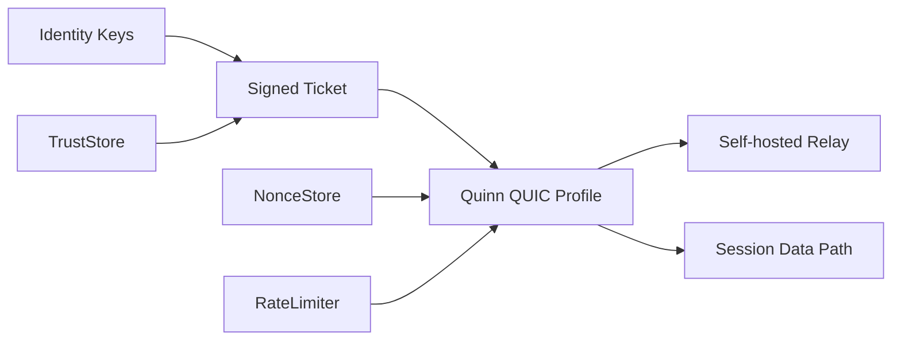

# SnapPipe

[](https://crates.io/crates/snappipe)
[](https://github.com/LOUST-PRO/SnapPipe/actions/workflows/ci.yml)
[](LICENSE-APACHE)
[](https://crates.io/crates/snappipe)

Identity-based transport toolkit for self-hosted, low-latency peer connectivity.

SnapPipe is meant to move the fallback story away from location-based addressing (`ip:port`) and toward **identity-based networking**:

- a node is identified by its **public key**, not by a volatile address
- sessions are gated by **signed tickets** before any peer attempts a handshake
- relay infrastructure is designed to be **self-hosted** instead of tied to a paid managed relay tier

## Why this exists

When strict NATs, firewalls, captive campus networks, or carrier-grade mobile networks force transport to degrade toward TCP-ish behavior, rollback-sensitive real-time sessions become fragile because of head-of-line blocking.

SnapPipe aims to provide a cleaner fallback layer:

- keep the connection anchored to an identity
- keep rebind/reconnect cheap when the network path changes
- keep the operator in control of relay infrastructure
- keep the software stack open and inspectable

## Current scope (v0.2.1)

This repository implements the **security / control-plane foundation**, hardened
through the audit-driven batch summarised in [`RELEASES.md`](RELEASES.md):

- Ed25519 identity generation
- stable NodeIds derived from public keys
- signed session tickets with explicit issuer and subject identities
- offline ticket verification, including cross-issuer rejection
- Quinn-based QUIC transport profiles for low-latency and relay-oriented tuning
- **identity-gated handshake**: `TrustStore` + `SignedTicket` gating before any peer
  is accepted (`NonNullIssuer` — empty trust store is NOT a default-allow state)
- **replay protection**: bounded `NonceStore` with TTL-bounded accepted-after-expiry
  classification
- **rate limiting**: per-NodeId token bucket with `set_limit` overrides from the
  trust store
- **ALPN source-of-truth**: client and server both derive from the `DEFAULT_ALPN`
  constant; mismatch fails the handshake cleanly
- **sub-second mtime** in the sync plane (`Mtime { secs, nanos }`); preserves
  intent on rapid successive writes
- **lock-free v0.3.0 trigger metrics** on `NonceStore` and `RateLimiter`
  (`AtomicU64` with `Ordering::Relaxed`) — see
  [`docs/SECURITY-MODEL.md`](docs/SECURITY-MODEL.md) for the migration trigger
- **CI hardening**: SHA-pinned GitHub Actions, `persist-credentials: false`,
  `concurrency.cancel-in-progress`, explicit `permissions: contents: read`,
  `cargo test --locked`
- **disclosure channel**: see [`SECURITY.md`](SECURITY.md)
- sample relay configuration scaffold
- CLI for issuing / inspecting / verifying tickets

## Architecture

Detailed system notes live in [`docs/SECURITY-MODEL.md`](docs/SECURITY-MODEL.md)
(threat model + hardening posture table + deferred-work rationale) and in
[`docs/OPERATIONAL-DEPLOYMENT.md`](docs/OPERATIONAL-DEPLOYMENT.md) (where
SnapPipe sits in the laptop ↔ VPS flow).


```mermaid
graph LR
   Identity[Identity Keys]
   Ticket[Signed Ticket]
   Trust[TrustStore]
   Nonce[NonceStore]
   Rate[RateLimiter]
   Quinn[Quinn QUIC Profile]
   Relay[Self-hosted Relay]
   Session[Session Data Path]

   Identity --> Ticket
   Trust --> Ticket
   Ticket --> Quinn
   Nonce --> Quinn
   Rate --> Quinn
   Quinn --> Relay
   Quinn --> Session
```

## Releases

| Version | Tag | Highlights |
|---|---|---|
| **v0.2.1** (current) | [`v0.2.1`](https://github.com/LOUST-PRO/SnapPipe/releases/tag/v0.2.1) | Hardening batch — see [`RELEASES.md`](RELEASES.md) and [`CHANGELOG.md`](CHANGELOG.md) |
| v0.1.0 | [`v0.1.0`](https://github.com/LOUST-PRO/SnapPipe/releases/tag/v0.1.0) | Initial release — identity + tickets + QUIC profiles + CLI |

SnapPipe is also published to crates.io under the `snappipe` crate name:

```bash
cargo add snappipe
```

The published crate metadata mirrors the `v0.2.1` git tag exactly
(Cargo.toml `version`, repository, license, keywords, categories).

## Why the name SnapPipe

The goal is that the pipe rebinds *fast* when the network changes.

And a second quality of the design is more personal / philosophical:

> a node has its own identity — it is not defined by a temporary IP, but by itself.

## Roadmap direction

The v0.2.1 hardening batch closed the audit-driven items on the previous roadmap.
Items remaining:

1. **NAT traversal / path agility** *(in progress)*
   - rebinding resilience
   - better behaviour on Wi-Fi ↔ 5G transitions
   - direct path first, relay second, but without collapsing into a paid managed
     control plane

2. **v0.3.0 trigger-driven migration** *(deferred until metrics cross the threshold)*
   - `dashmap::DashMap<NodeId, TokenBucket>` for `RateLimiter`
   - A sharded `NonceStore` (16 shards keyed by `nonce[0]`)
   - Bounded `parking_lot::Mutex` if `std::sync::Mutex::lock()` itself is hot

   The trigger is `>100 try_consume_calls / sec` per edge, measured via the
   in-code metrics in PR #9. See [`docs/SECURITY-MODEL.md`](docs/SECURITY-MODEL.md)
   for the full rationale.

## CLI

### Generate identity keys

```bash
cargo run -- keygen --out identity.secret --public-out identity.public
```

Outputs:

- `identity.secret` — base64url Ed25519 keypair bytes
- `identity.public` — base64url public key / node identity

### Issue a ticket

```bash
cargo run -- ticket issue \
  --secret-key identity.secret \
   --subject-public-key peer.public \
  --relay-url quic://relay.example.net:4433 \
  --alpn /snappipe/0 \
  --ttl-seconds 300 \
  --output session.ticket.json
```

If `--subject-public-key` is omitted, the issuer defaults to issuing a self-ticket for its own identity.

### Inspect a ticket

```bash
cargo run -- ticket inspect --ticket session.ticket.json
```

### Verify a ticket

```bash
cargo run -- ticket verify \
  --ticket session.ticket.json \
  --public-key identity.public
```

### Emit a sample relay config

```bash
cargo run -- relay sample-config --output relay.sample.toml
```

### Emit a QUIC transport profile

```bash
cargo run -- quic profile \
   --preset low-latency-interactive \
   --alpn /snappipe/0 \
   --output quic.profile.json
```

### Print lock-free metrics (JSON)

```bash
cargo run -- metrics
```

Drives a small reproducible workload against fresh `NonceStore` and
`RateLimiter` instances, then prints both metric snapshots as a single
JSON document. Useful as a smoke test and as the live reference of the
metrics schema. Operators diff two consecutive snapshots over a known
interval to derive throughput; sustained `>100 try_consume_calls/sec`
per edge is the v0.3.0 migration trigger documented in
[`docs/SECURITY-MODEL.md`](docs/SECURITY-MODEL.md).

## Example relay config

A starter config lives in:

- `examples/relay.sample.toml`

This is not a full relay implementation yet; it is the operator-facing contract scaffold for the next phase.

## Testing

```bash
cargo test
```

The full test surface (`cargo test --locked`) currently runs **63 tests**
across the library, the integration test in `tests/integration_trust_sync.rs`,
and the end-to-end QUIC tests in `tests/quic_e2e.rs`. The CI workflow pins
the exact action SHAs and uses `cargo test --locked` so `Cargo.lock` is the
source of truth.

## QUIC notes

The repository includes Quinn-based transport profiles in `src/quic/`
(mod.rs + endpoint.rs) for:

- low-latency interactive sessions
- relay/backhaul-oriented sessions

Both client and server endpoints derive the ALPN from the `DEFAULT_ALPN`
constant via the `default_alpn_bytes()` helper. Mismatched ALPN values fail
the handshake cleanly instead of silently progressing to a degraded state.

## Security

- See [`SECURITY.md`](SECURITY.md) for the disclosure process.
- See [`docs/SECURITY-MODEL.md`](docs/SECURITY-MODEL.md) for the threat model,
  hardening posture table, and deferred-work rationale.

The disclosure channel is `opensource@loust.pro` with a 48-hour
acknowledgment SLA; coordinated 90-day disclosure is preferred.

## Contribution flow

- use short-lived branches for each architectural slice
- open PRs even inside the same repo so changes stay reviewable
- keep transport, relay, and ticket/auth work in separate review units
- preserve the compatibility path while adding faster optional overlays

## Licensing

Licensed under Apache-2.0. See [`LICENSE-APACHE`](LICENSE-APACHE) for the
full text. This is a deliberate single-license choice made on 2026-06-25:
the explicit patent grant and retaliation clause are the right fit for
B2B/infra tooling. Earlier dual-license (`MIT OR Apache-2.0`) was used
during initial bootstrap; that combination is no longer offered.

## Notes on inspiration

This project is informed by the practical strengths of identity-centric networking tools and QUIC-based transport designs, but it is intentionally being built as an operator-controlled OSS path with self-hostable relay assumptions.