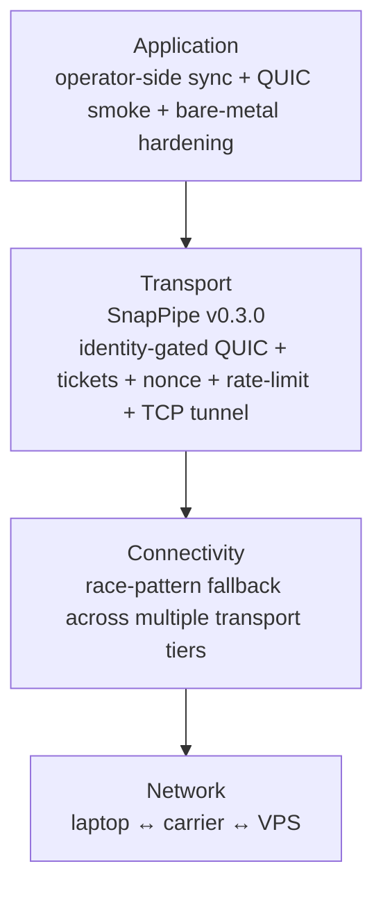

# How it works

This page walks the SnapPipe hot path end to end so you understand
exactly what runs when a peer connects. It also positions SnapPipe
in the operator's stack as one of three distinct layers.

## Where SnapPipe sits

SnapPipe is the **transport** layer — the concern between
"connectivity" (how bytes traverse the carrier) and "application"
(what data moves). It does not solve carrier-level UDP blackholes
or NAT traversal (that's a connectivity concern), and it does not
move your application data (that's an application concern). What
it does is **gate** the byte stream: decide who is allowed to
talk, enforce replay protection, and rate-limit per peer.



A failure in one layer does not necessarily fail the others. If
the transport layer rejects a peer (untrusted issuer), the
connectivity layer still completes the TCP+TLS path; the
application never sees a half-open session.

## The handshake, step by step

When a peer presents a `SignedTicket` to the relay, the relay
runs four gating checks before promoting the QUIC stream to a
session:

1. **Issuer trust check.** The ticket's `issuer` field must match a
   registered `NodeId` in the relay's `TrustStore`. An empty store
   fails-closed: no issuer matches, the handshake is rejected.
   ```rust
   let pk = trust_store.lookup(&ticket.issuer)?;
   // .lookup() returns Err(TrustStoreMiss) if no entry exists
   ```
2. **Signature verification.** The ticket's signature must verify
   against the looked-up `VerifyingKey`. Any tampering with the
   ticket body invalidates the signature.
   ```rust
   pk.verify(&ticket.body, &ticket.signature)?;
   // .verify() is constant-time; tampering produces Err(InvalidSig)
   ```
3. **Nonce replay check.** The ticket's 16-byte nonce must not
   have been seen inside the 60-second TTL window. The relay
   records the nonce atomically on first sighting; replays inside
   the window are rejected with `Error::NonceReplay`.
4. **Rate limit check.** The ticket's `issuer` NodeId must not have
   exceeded its per-minute budget. The default is 100 req/min; a
   per-NodeId override is enforced via the trust entry.

If any check fails, the relay tears down the QUIC stream without
forwarding application bytes. The application layer never sees a
half-open session.

## Trust store semantics

The `TrustStore` is the **only** mechanism for adding a peer. There
is no `--allow-all` flag, no environment variable bypass, no
config-file hot-reload that adds a peer automatically. Every entry
is operator action:

```rust
let mut store = TrustStore::load_or_default(&path)?;
store.add_peer(PeerEntry {
    node_id: "laptop-prod-1".into(),
    public_key: <verifying key bytes>,
    rate_limit_per_min: Some(100), // None means default
})?;
store.save(&path)?;
```

The `load_or_default` function returns `Result<TrustStore, Error>` —
it does **not** default to an allow-all store on I/O error. An
operator who can't read their trust file gets a daemon that refuses
all connections until the file is restored. This is deliberate: a
broken trust file is a security incident, not a degraded mode.

## Nonce store semantics

The `NonceStore` enforces a 60-second TTL on seen nonces. Three
properties matter:

- **Atomicity.** `check_and_record(nonce) -> Result<bool>` is
  implemented as a single critical section under a
  `std::sync::Mutex<HashMap<_, _>>`. The lock is held briefly — no
  `.await` is held across the critical section.
- **TTL expiry.** After 60 seconds, the nonce is forgotten. A peer
  reusing a ticket after that window is allowed. This is the
  intended behaviour: tickets are short-lived credentials, not
  permanent authorisations.
- **Metrics.** `NonceStore::metrics() -> NonceStoreMetrics` exposes
  the four lock-free counters operators use to detect replay
  storms: `total_check_calls`, `total_accepted`,
  `total_rejected_replay`, `total_accepted_after_ttl`.

The Mutex is the documented bottleneck for v0.3.0+ workloads —
see [Security model](./security-model.md#known-technical-debt) for
the migration trigger.

## Rate limiter semantics

The `RateLimiter` is a per-NodeId token bucket. Each bucket starts
full at the default 100 req/min budget. Each request consumes one
token; buckets refill at the per-minute rate.

Three properties matter:

- **Per-NodeId isolation.** A peer exceeding its budget does not
  affect any other peer's budget. A burst from one peer cannot
  starve a different peer.
- **Zero-clamp on `set_limit(0, _)`.** A misconfigured
  `RateLimiter::set_limit(&id, 0, _)` is clamped to
  `DEFAULT_RATE_PER_MIN`, not silently disabled. This prevents an
  accidental zero from turning into a deny-all state.
- **Metrics.** `RateLimiter::metrics() -> RateLimiterMetrics`
  exposes `total_try_consume_calls`, `total_allowed`,
  `total_denied`, `total_set_limit_calls`, `tracked_nodes`.
  Operators diff two consecutive snapshots to derive throughput.

The Mutex is the same hot-path bottleneck as `NonceStore`. v0.3.0
deferred migration; the documented trigger is
`>100 try_consume_calls / sec` per edge.

## Why these primitives are separate

It would be tempting to fold all four gating checks into a single
"connection policy" struct. We deliberately keep them separate so:

- Each can be tested in isolation (the unit tests for
  `NonceStore::check_and_record` don't need a `TrustStore`).
- Each can be swapped independently (an operator who needs mTLS at
  the QUIC layer can layer it on via `rustls::ClientConfig` without
  touching the application-layer identity gate).
- Each has its own metrics (replay-storm detection vs
  rate-limit-storm detection are different signals).

The split is a property of the API surface, not an implementation
detail. Library users see four distinct types; CLI users see the
gating as a single `--key` + `--ticket` + `--relay` invocation.
